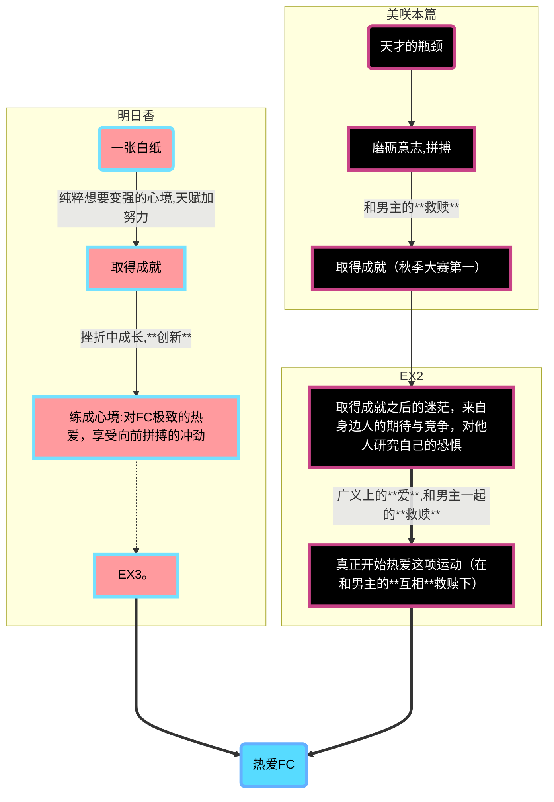

>仰望天空，注视天空，答案就在那里......
(cg)

# 苍之彼方的四重奏 玩后点评
# 本文含有大量剧透内容
# 本文含有大量剧透内容
# 本文含有大量剧透内容

直接进主题吧，本作最突出的两个点就是**青春感**和**救赎**。
不在这里进行剧情概括了。
## 共通线，整体剧情点评
共通线节奏属于较为舒服的，张弛有度。特别是打空竞的时候，演出是真的可以调动那种期待，紧张的情绪。
不过进线的选项，个人感觉除明日香线，其他的选项给人一种无理由放弃某一个女主的感觉，，观感说实话并不是太好，不过进了线就好了。
次要角色塑造的不差，部长，葵老师，佐藤院，真藤等等，个人性格非常明确，剧情走向也没有问题。
~~窗果为什么不能推~~

## 个人线点评
### 明日香线，美咲线
#### 主题概括
*恋*并不是唯一主题。

明日香给人的感觉是永远积极向上，不怕挫折，只为了热爱往前冲的形象。
她能在竞技运动中发掘出真正的快乐（“救赎”了沙希，让每一个和她打比赛的选手最后都能笑着接受结果），创新的思维（和沙希打比赛时关掉平衡器，并深深影响FC）。
她是在发自内心的去爱这项运动本身（结果无关论）。
胜固欣然，败亦可喜，创新，这三点就是明日香线暗含的思想。

---
而美咲线透露出的思想则更加深刻。“天才”的包袱，青春的迷茫，对压力的恐惧，这一切，全部和男主在**救赎**的道路上慢慢被美咲所接受（部分并没有克服，减弱）。
这条线的中心主题就是**救赎**。

美咲身上有天才那种无所谓的性格，但却在深刻认识到自己真真切切实力不足后近乎绝望，想要放弃（事实上确实放弃了一段时间）。
然后我们的男主就来救赎了。
男主和美咲的立场恰好相反，他放弃FC的原因正是*天才让努力的人绝望*，并且那个让他放弃的天才就是美咲。
虽说立场相反，但两人身上的相似之处有很多。
男主踏上了救赎美咲之路，也是为了**救赎自己**。
努力，再努力，最终取得了非凡的成就（秋季大赛第一）。
~接EX2~
取得了这样的成就后，周围人的期待，对手对自己彻头彻尾的研究，让美咲恐惧，怀疑自己配不配得上这个位置。
周围人发起的挑战接踵而至，让她感到迷茫。
男主和美咲一起，互相救赎。
最终，美咲也类似明日香那样，对FC的热爱。
但这里的热爱，是建立在男主和美咲的**救赎**之上的。
所以说，美咲线和EX2最大的主题就是**互相**救赎。
美咲才是真女主，，

#### 明日香线
节奏很舒服，告白场景很美，**发饰伏笔怎么没收，，** 是准备放在EX3里面吗。
>为什么还不出EX3，sbrite i need EX3，，别鼓捣你那百合新作了。。。

泽田夏老师的配音真神了，那种惰懒却又不失决心的配音真的好有感觉。
hs的时机和数量太恰到好处了，这点是最舒的。

#### 美咲线&EX2
美咲的性格非常戳人。
美咲线的一个情节块（大赛前两人在美咲家，连续2h部分）有种很强的*场景切换*的连贯感，是一种前所未有的耳目一新的情节叙述方式。

### 真白线&EX1
只能说是很标准的废萌叙事，没有太多深层次出彩的地方，质量还行。
EX2可爱完了，，cg也是非常有氛围感。
还得是萌，也是成功在投票中打败明日香。
*明日香的败犬属性在这条线里面体现的最淋漓尽致哈哈。然后是美咲线。*

### 莉佳线
这条线真有点敷衍了。。甚至把美咲的性格都硬生生掰直，叙事也过于快，忽略了很多东西。
虽说是学妹，但莉佳给人一种成熟的感觉。
~~！？人妻？！~~
正因为敷衍，所以没什么好评价的。剧情还可以。

## Others
音乐非常不错，属于脑袋里会时不时想起旋律的那种。
小提琴的使用非常有特色，有意境。

系统方面，如果苍彼是krkr这类引擎做的那做的还算可以，但它是用unity做的，只能说还差点意思。完全没有已读文本的相关功能，没有跳转到选项，ui右下的按钮不能隐藏，这些都是槽点。
EX2开了图像高清化以后会变得异常地卡，而且开不开图像高清化貌似在视觉层面上没有太大变化。
立绘鉴赏看不到腿部及以下的地方，mask的错误用法。。

---
总体来说，本作是一部相当优秀的作品，值得一试。
>我要EX3，，i need EX3，，，

cg

